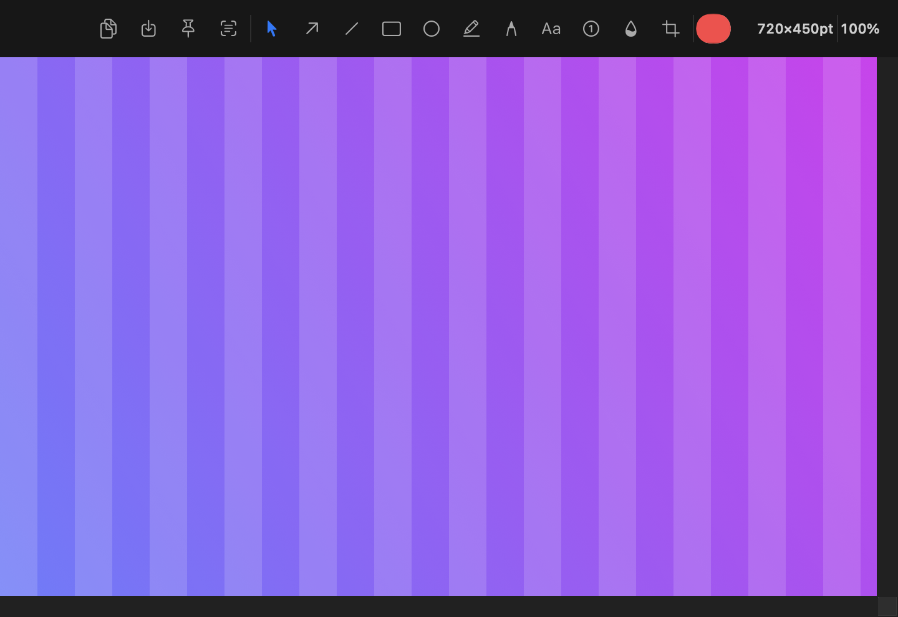

# Snippr ✂️

A fast, native screenshot tool for Apple Silicon and Intel Macs — capture, annotate, OCR and scrolling screenshots, all offline. Inspired by the excellent [Shottr](https://shottr.cc), rebuilt from scratch in Swift.

**[⬇ Download Snippr](https://snippr.pages.dev)** · macOS 14+ · Apple Silicon & Intel



## Features

- **Capture**: fullscreen `⇧⌘1`, area selection `⇧⌘2` (frozen-screen overlay with crosshair), active/any window with styled backgrounds (wallpaper / transparent / solid / trim shadow), delayed 3s, repeat last area
- **Scrolling capture**: auto-scrolls the page and stitches frames pixel-perfectly (up or down)
- **OCR / QR** `^⌥⌘O`: select an area, text lands in your clipboard — English & Vietnamese, powered by Apple Vision, fully offline
- **Editor**: arrow, line, rect, oval, highlighter, pen, text, counter badges, pixelate, crop — with undo/redo, scroll-wheel zoom, `Esc` to copy & close
- **Pin** any shot as a floating always-on-top window; corner thumbnail previews
- **Everything local**: no accounts, no uploads, no analytics

## Install

1. Download the DMG, drag **Snippr** into **Applications**
2. First launch: the app is not notarized, so macOS will warn you —
   open **System Settings → Privacy & Security** and click **Open Anyway**
   (or run `xattr -cr /Applications/Snippr.app`)
3. Grant **Screen Recording** permission when prompted (and **Accessibility** if you want scrolling capture), then relaunch

## Build from source

Requires Xcode 16+ on Apple Silicon:

```bash
./build.sh          # → build/Snippr.app
```

Plain SwiftPM + a bundling script — no Xcode project. Useful entry points:

| Path | What |
|---|---|
| `Sources/Snippr/AppDelegate.swift` | menu bar, capture flows, routing |
| `Sources/Snippr/CaptureEngine.swift` | ScreenCaptureKit wrapper |
| `Sources/Snippr/SelectionOverlay.swift` | area / window-pick overlay |
| `Sources/Snippr/ScrollingCapture.swift` | auto-scroll + stitcher |
| `Sources/Snippr/EditorWindow.swift` | annotation editor |
| `Sources/Snippr/SelfTest.swift` | `Snippr --selftest` headless tests |

Note: the app is ad-hoc signed, so macOS ties permissions to each build — after rebuilding you'll need to re-grant Screen Recording.

## License

MIT — see [LICENSE](LICENSE).

Made with [Claude Code](https://claude.com/claude-code) 🤖
